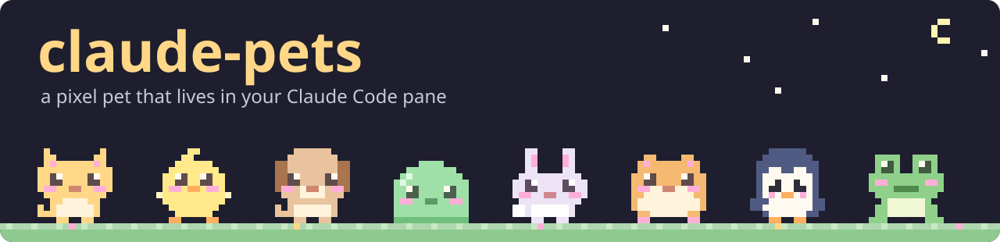
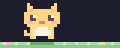
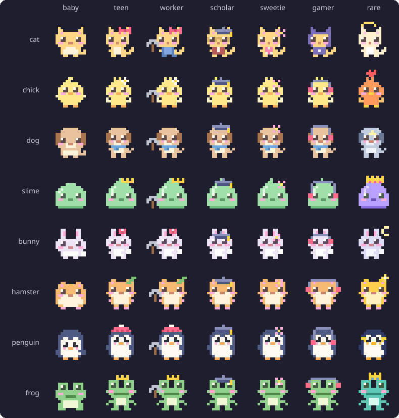
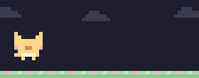
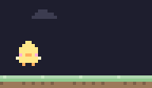
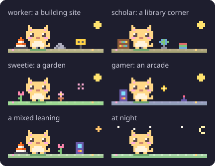

<h1 align="center"></h1>

A pixel pet that lives in a Claude Code pane. It wanders while you work, reacts to what your session does, and grows across sessions. Eight to choose from: <code>cat</code> · <code>chick</code> · <code>dog</code> · <code>slime</code> · <code>bunny</code> · <code>hamster</code> · <code>penguin</code> · <code>frog</code>.

<p align="center"></p>

> [!NOTE]
> This is a Claude Code *mod* (a plugin of function hooks). The mod API is early access, so a new Claude Code release may break the pet until this plugin catches up.

## Install

```
/plugin marketplace add uppinote20/claude-pets
/plugin install pets@claude-pets
```

Then type `/pet`. To try it from a clone: `claude --plugin-dir /path/to/claude-pets`.

## Commands

| Command | What it does |
|---------|--------------|
| `/pet` | Let the pet out |
| `/pet pat` | Pat it |
| `/pet name <name>` | Name it (up to 20 characters) |
| `/pet choose <species>` | Bring out another pet (each species is its own pet, with its own name and level) |
| `/pet size small\|medium` | Pane height: 6 or 9 rows (default `medium`) |
| `/pet play` | Pet Run: `j` jump · `r` again · `Esc` stop |
| `/pet quest [stage]` | Pet Quest: `j` jump (again while rising: higher) · `r` retry · `n` next |
| `/pet status` | Level, experience, nature, rhythm and counts |
| `/pet bye` | Close the pane (or `ctrl+x x`) |

The pane's `✕` is clickable in the fullscreen layout (`/tui fullscreen`) only; on the main screen the terminal reports no clicks.

## How it grows

It reacts to your session: notes while tools run, a jump when a turn finishes, a nap after two quiet minutes, a tear when a rate-limit window passes 80%. Everything it lives through is experience, kept across sessions:

| Event | XP |
|-------|---:|
| Tool call | 1 |
| Game snack (Pet Run, Pet Quest) | 1 |
| Pat | 2 |
| Finished turn | 5 |
| 1,000 output tokens | 1 |
| Gift, lucky pat | 5–100 |

It counts whenever the plugin is loaded, whether or not the pane is open. Only output tokens count: input and cache reads grow with the conversation's length, not with the work done.

Level `n + 1` takes `25 × n²` XP (Lv 5 at 400, Lv 10 at 2,025, Lv 50 at 60,025), with no cap.

| Stage | From | Looks |
|-------|------|-------|
| Baby | Lv 1 | As drawn |
| Teen | Lv 15 | A taller body, and its accessory (a ribbon, a flower, a scarf, a crown, a leaf, a knit hat) |
| Adult | Lv 40 | Evolves into the form of its nature (below), and twinkles. One in twenty takes the **rare form** instead |

<p align="center"></p>

## Games

<table>
<tr>
<td align="center"><br><code>/pet play</code>: Pet Run</td>
<td align="center"><br><code>/pet quest</code>: Pet Quest</td>
</tr>
</table>

Snacks from both games are experience. What a game earned stays with the pet that played it, even if you `/pet choose` another mid-game.

<details>
<summary><b>How to play</b></summary>

### Pet Run

`/pet play` opens a runner in its own pane. The pet runs along the grass: jump the bugs (`j`, or the Jump button) and snap up the snacks floating over them. It gets faster as it goes. `r` runs again after a bug, `Esc` stops. Its best score is kept.

### Pet Quest

`/pet quest` opens the next stage of an auto-running side-scroller. The pet runs on its own; `j` jumps, and a second `j` while rising takes it higher, even off the top of the view (an arrow shows where it will land). Stomp the bugs from above, knock the gift boxes from below for snacks, hop the stumps and pits, and reach the snack bowl. A wall stops it until it jumps.

Eight stages, each opened by clearing the one before; `/pet quest 3` replays one already open. Stages are tile maps in [`hooks/quest.ts`](hooks/quest.ts), one character per 4×4 tile (all eight take about 7 KB), and a test searches every stage for a way through.

`/pet status` counts the snacks of both games together. Off the terminal both games draw as SVG, with buttons to tap.

</details>

## It takes after you

What you do most becomes its **nature**, and the yard grows that way: a building site, a library corner, a garden or an arcade, tinted to match, under your local sky.

<p align="center"></p>

<details>
<summary><b>Nature, leaning and rhythm</b></summary>

### Nature

Its **nature** is the side of you it sees most, once it has seen enough:

| Nature | From | How it shows |
|--------|------|--------------|
| worker | tool calls | holds up a laptop while tools run; as an adult, swings a pickaxe |
| scholar | turns and output | ambles and stops to read; as an adult, a graduation cap |
| sweetie | pats | pauses for a heart; as an adult, a flower pin |
| gamer | game snacks | runs faster and kicks a ball; as an adult, a headset |
| curious | (until one side stands out, or two tie) | sniffs around |

The nature follows its **leaning**: the shares of the four sides, which move once a day by 12% toward what that day brought. A long session changes nothing until the day is over, and old habits fade slowly: a new prop shows after a few days of a new habit, a new form after about two weeks. An adult whose leaning has clearly moved on (the new side well ahead, the old one faded) takes the new side's form; a toast says so. The rare form stays.

### The yard

The yard shows the leaning. Each side fills it a prop at a time and tints the grass its way: a building site (cones, barriers, a warning sign), a library corner (a bookshelf, a lamp, a globe), a garden (tulips, a heart bush, a butterfly), an arcade (a cabinet, a trophy, a joystick). A mixed leaning makes a mixed yard.

It follows your local clock (read from `date`): the morning, midday and evening sun, and the moon and stars at night. Off the terminal, the card turns night blue.

### Rhythm

Its **rhythm** comes from the hours your finished turns keep: night owl, early bird, daytimer or evening type. Nature and rhythm show in the stats and in `/pet status`, and the pet muses about them now and then.

</details>

<details>
<summary><b>Adult forms</b></summary>

The form is settled the moment it reaches Lv 40 (by any experience, games included) and kept from then on.

- **By nature**: the cat has a drawing of its own for each (overalls, a scholar's robe and glasses, a hoodie, extra fluff). The others are their teen in their nature's gear until theirs are drawn.
- **Rare** (one in twenty, with `luck` on): the celestial cat, the phoenix chick, the moon wolf, the king slime, the moon bunny, the golden hamster, the emperor penguin, the prince frog.

</details>

<details>
<summary><b>Luck</b>: gifts, lucky pats, shiny pets</summary>

- **Gifts**: one finished turn in ten turns up a gift: mostly a cookie (+5 XP), sometimes a toy (+15) or a treasure (+40), now and then the jackpot (+100), and one gift in a hundred is a sparkle stone.
- **Lucky pats**: one pat in ten is worth three times as much.
- **Shiny pets**: a pet met for the first time (your very first cat included) is shiny one time in 32, in colors of its own (`✦` in the stats). A sparkle stone makes the pet that is out shiny; a second one is a jackpot.

Turn it all off with the plugin's `luck` setting (`/config`).

</details>

<details>
<summary><b>How it is drawn</b>: sizes, surfaces, hi-res art</summary>

| Size | Sprite | Terminal rows |
|------|--------|---------------|
| `small` | 8×8, at every stage | 6 |
| `medium` | 12×12 | 9 |

The pane opens at that height; a height you drag it to yourself wins. With room (above a wide prompt, or docked), a stats panel sits beside or under the yard; otherwise the line above the pet shows the level.

| Surface | Drawn as |
|---------|----------|
| Terminal | Half-block cells (`Raster`) |
| kitty, Ghostty | One image of the yard, the pet in hi-res art (detected from `TERM` / `TERM_PROGRAM`) |
| Desktop, VS Code, mobile | An SVG card with a name tag, a speech bubble and a grass mound, the pet in hi-res art |

The hi-res art is 32×32, outlined and shaded, and every species has its baby and teen drawn so far, in [`hooks/art.ts`](hooks/art.ts). Adults, shiny pets and rare adults use the pixel sprite until their art is drawn. Set the plugin's `art` setting to `pixel` to keep half blocks everywhere.

</details>

<details>
<summary><b>On mobile</b></summary>

The pet runs wherever Claude Code runs, so the plugin has to be loaded by the session the app is looking at:

- **Remote Control**: install the plugin on your computer, run `claude remote-control` in the folder you work in, and open that session in the Claude Code app. Type `/pet` there.
- **Claude Code on the web**: a cloud session loads the plugins its repository's `.claude/settings.json` enables (`extraKnownMarketplaces` and `enabledPlugins`), so add `pets@claude-pets` there and open that session in the app.

</details>

<details>
<summary><b>Contributing</b>: adding a species, development</summary>

### Adding a species

A species is drawn twice in [`hooks/species.ts`](hooks/species.ts), one character per pixel, facing left: `big` at 12×12 and `mini` at 8×8.

```ts
big: {
  rows: [
    '.o........o.',
    '.oo......oo.',
    '.opoooooopo.',
    'oooooooooooo',
    'oowkoooowkoo',   // eyes: 2×2, a white glint in the top corner
    'ookkooookkoo',
    'oppoommooppo',   // blush and a small mouth
    // ...12 rows of 12 characters
  ],
  eyesShut: { 4: 'oooooooooooo' },   // the glint row turns to fur: a closed, happy line
  tear: { 6: 'obpoommooppo' },
  feetApart: { 11: '..oo....oo..' },
},
ink: { o: 0xffd787, w: 0xfffaf0, p: 0xffafd7, k: 0x5f4b4b, m: 0xd08770, b: 0x87d7ff },
```

`.` is empty; every other character needs a color in `ink`. Keep the shared face marks (`w` glint, `k` eyes, `p` blush, `b` tear). Supply by row index the rows that replace the eyes, the cheek and the feet. A species also needs a `teen` sprite, an `accessory` for each size, its `head` position (where gear sits), `shiny` colors and a `rare` form: copy an existing species as a start. Then add it to the species list above and regenerate `assets/`. A test checks every row's width and colors.

### Development

```bash
claude plugin validate .claude-plugin/plugin.json   # manifest and hooks module
claude plugin test .                                # tests/*.test.ts
node scripts/sprites.mjs && node scripts/demo.mjs && node scripts/showcase.mjs   # regenerate assets/ (Node 22.18+)
```

The drawing lives in [`hooks/scene.ts`](hooks/scene.ts), which has no `$`, so tests draw exactly what the pane does. CI fails when `assets/` is stale. Once Claude Code has loaded the plugin from this folder it lays its type declarations in `.claude-plugin/types/`, and `tsc -p .` type-checks the plugin.

</details>

## License

MIT
