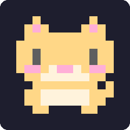
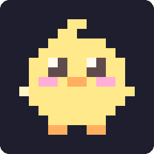
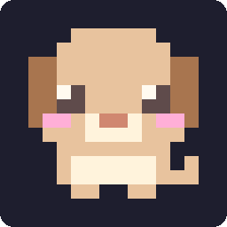
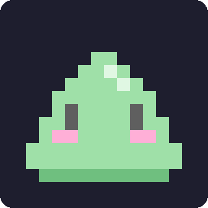
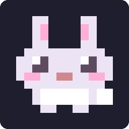
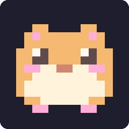
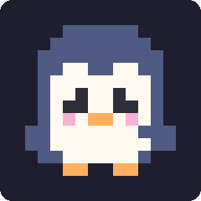
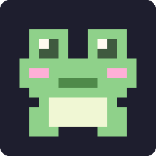

# claude-pets

A pixel pet that lives in a Claude Code pane. It wanders while you work, reacts to what your session does, and grows across sessions.

<p align="center"></p>

|  |  |  |  |
|:---:|:---:|:---:|:---:|
| `cat` | `chick` | `dog` | `slime` |
|  |  |  |  |
| `bunny` | `hamster` | `penguin` | `frog` |

> **Early access.** This is a Claude Code *mod* (a plugin of function hooks). That API is early access and can change between Claude Code releases, so a new release may break the pet until this plugin catches up.

## What it does

- **Wanders**: paces a small yard, bouncing as it steps, and blinks now and then.
- **Reacts**:
  - takes notes while tools run
  - jumps when a turn finishes
  - naps after about two minutes of quiet
  - tears up when a rate-limit window passes 80%
- **Grows**: tool calls, finished turns, output tokens and pats add experience. The level is kept across sessions. When the pane has room (above a wide prompt, or docked beside the transcript) a stats panel shows the level, the bar to the next one, and how many of each it has seen; otherwise the line above the pet shows the level.
- **Is yours**: give it a name and pick its species.

## Install

```
/plugin marketplace add uppinote20/claude-pets
/plugin install pets@claude-pets
```

To try it from a clone instead:

```bash
claude --plugin-dir /path/to/claude-pets
```

## Commands

| Command | What it does |
|---------|--------------|
| `/pet` | Let the pet out |
| `/pet pat` | Pat it |
| `/pet name <name>` | Name it (up to 20 characters) |
| `/pet choose <species>` | Bring out another pet: `cat`, `chick`, `dog`, `slime`, `bunny`, `hamster`, `penguin`, `frog` |
| `/pet size <size>` | How tall the pane is: `small` (6 rows) or `medium` (9, the default) |
| `/pet play` | Play Pet Run: `j` jumps, `r` runs again, `Esc` stops |
| `/pet quest [stage]` | Play Pet Quest, a platformer: `j` jumps (again while rising to go higher), `r` retries, `n` goes on |
| `/pet status` | Level, experience and counts |
| `/pet bye` | Close the pane |

`ctrl+x x` also closes the pane.

## Growth

Every species is its own pet, with its own name and its own level. Switching with `/pet choose` leaves the others where they were.

| Event | Experience |
|-------|------------|
| Tool call | 1 |
| Pet Run snack | 1 |
| Pat | 2 |
| Finished turn | 5 |
| 1,000 output tokens | 1 |

Only output tokens count. Input and cache reads grow with how long the conversation is, not with how much work was done.

A pet reaches level `n + 1` at `25 × n²` experience: level 2 at 25, level 5 at 400, level 10 at 2,025, level 50 at 60,025. Early levels come within an evening; later ones take longer and there is no cap.

### Stages

| Stage | From | Looks |
|-------|------|-------|
| Baby | Lv 1 | As drawn |
| Grown | Lv 15 | Wears its accessory: the cat and the bunny a ribbon, the chick a flower, the dog a scarf, the slime and the frog a crown, the hamster a leaf, the penguin a bow tie |
| Star | Lv 40 | Its accessory, and a twinkle beside its head |

A toast says when it grows up or becomes a star. Levels and what is kept do not change: a pet that is already past Lv 15 wears its accessory the next time it is out.

## Pet Run

`/pet play` opens a runner in its own pane. The pet runs along the grass: jump the bugs (`j`, or the Jump button), and snap up the snacks floating over them. It gets faster as it goes. `r` runs again after a bug, `Esc` stops.

Every snack is 1 experience for the pet, and its best score is kept (`/pet status`). Off the terminal (desktop, mobile) the course is drawn as an SVG and the buttons take the taps.

## Pet Quest

`/pet quest` opens the next stage of a side-scroller in the spirit of the auto-running Marios. The pet runs on its own; `j` jumps, and a second `j` while it is rising takes it higher. Stomp the bugs from above, knock the `?` blocks from below for snacks, clear the pits and pipes, and reach the flag. A wall stops it until it jumps.

Three stages, each opened by clearing the one before (`/pet quest 2` replays one already open). Snacks are experience as in Pet Run, and `/pet status` counts the stages cleared.

Stages are tile maps in [`hooks/quest.ts`](hooks/quest.ts), one character per 4×4 tile, so all three take about 2 KB. A test searches every stage for a way through, so a stage that cannot be cleared fails the build.

## Sizes

`/pet size` picks how much room the pet takes, and it is kept across sessions:

| Size | Sprite | Terminal rows |
|------|--------|---------------|
| `small` | 8×8 | 6 |
| `medium` | 12×12 | 9 |

The pane opens at that height. A height you drag the pane to yourself wins over it.

## Adding a species

A species is drawn twice in [`hooks/species.ts`](hooks/species.ts), one character per pixel: `big` at 12×12 and `mini` at 8×8 for the small size.

```ts
big: {
  rows: [
    '.o........o.',
    '.oo......oo.',
    '.opoooooopo.',
    'oooooooooooo',
    'oowkoooowkoo',   // eyes: 2×2, a white glint in the top corner
    'ookkooookkoo',
    'oppoommooppo',   // blush and a small mouth
    // ...12 rows of 12 characters
  ],
  eyesShut: { 4: 'oooooooooooo' },   // the eyes' top row turns to fur: a closed, happy line
  tear: { 6: 'obpoommooppo' },
  feetApart: { 11: '..oo....oo..' },
},
ink: { o: 0xffd787, w: 0xfffaf0, p: 0xffafd7, k: 0x5f4b4b, m: 0xd08770, b: 0x87d7ff },
```

`.` is empty; every other character needs a color in `ink`. Draw it facing left, with a big head and a small body. Then supply, by row index, the rows that replace the eyes (`eyesShut`), the cheek row (`tear`) and the feet (`feetApart`). A test checks every row's width and colors.

## Development

```bash
claude plugin validate .claude-plugin/plugin.json   # manifest and hooks module
claude plugin test .                                # tests/*.test.ts
```

The species images and the demo GIF in `assets/` are generated from the sprite data with the plugin's own drawing code. Regenerate them after adding or changing a species, or the drawing (Node 22.18+, no dependencies):

```bash
node scripts/sprites.mjs
node scripts/demo.mjs
```

Once Claude Code has loaded the plugin from this folder it lays its type declarations in `.claude-plugin/types/`, and `tsc -p .` type-checks the plugin.

On the terminal the pet is one `Raster` element of half-block cells. Surfaces without `Raster` (desktop, VS Code, mobile) draw the same pixels as an `Svg` card, with a name tag, a speech bubble and a grass mound. The drawing lives in [`hooks/scene.ts`](hooks/scene.ts), which has no `$`, so tests can draw exactly what the pane does.

## On mobile

The pet runs wherever Claude Code runs; the Claude mobile app is one more surface drawing the pane, so the plugin has to be loaded by the session the app is looking at:

- **Remote Control**: install the plugin on your computer, run `claude remote-control` in the folder you work in, and open that session in the Claude Code app on your phone. Type `/pet` there.
- **Claude Code on the web**: a cloud session loads the plugins its repository's `.claude/settings.json` enables (`extraKnownMarketplaces` and `enabledPlugins`), so add `pets@claude-pets` there and open that session in the app.

The app has no `Raster`, so it draws the SVG card.

## License

MIT
